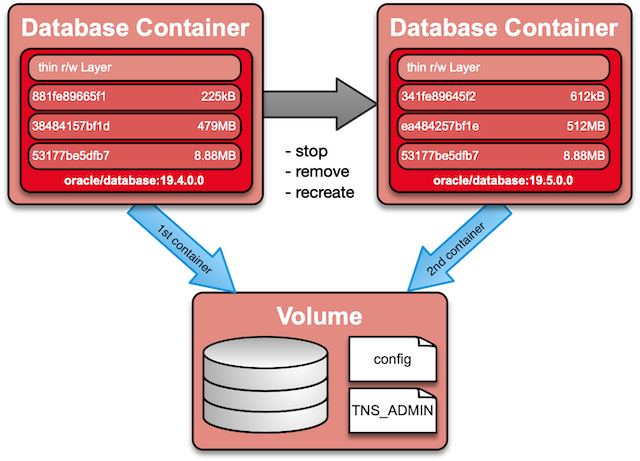

# Patch Test Oracle Database

This example shows how to install an Oracle release update (RU) on an Oracle database in a Docker Container. The persistent data (e.g. data files, config files etc.) is stored on an external volume. This allows to stop / remove the container and create a new one based on a Docker image with additional RU's, patch etc. The startup script `00_run_datapatch.sh` will run Oracle *datapatch* to apply / rollback the patch in the database. Some prerequisites and basic principles:

- `00_run_datapatch.sh` does check if you database has java installed. If so, it will restart the database in upgrade mode to run *datapatch*.
- If database is a container database the PDB's will be open to run datapatch.
- This use case does only run within an Oracle major release eg. 19.x.0.0 or 18.x.0.0 but not as an method to upgrade from 18c to 19c.
- It is relevant it you have a basic container with an RU or any kind of one-off patch.

The following figure illustrates the patch process of an Oracle database container.



## Run the Patch Use Case

Update the `docker-compose.yml` file and set the desired base image. Default is 19.4.0.0.

```bash
vi docker-compose.yml
```

Create a container **tcpu01** using `docker-compose`. This will also create an initial database *TCPU01*.

```bash
docker-compose up -d
```

Monitor the progress of database creation using `docker-compose`.

```bash
docker-compose logs -f
```

The database is ready when you see the following message in your docker logs.

```bash
---------------------------------------------------------------
 - DATABASE TDB194S IS READY TO USE!
---------------------------------------------------------------
```

You now can shutdown and destroy the container using `docker-compose`. Database will remain since it is stored on a voluem / bind-mount folder.

```bash
docker-compose down
```

Update the `docker-compose.yml` file and set the desired base image. e.g 19.5.0.0.

```bash
vi docker-compose.yml
```

Re-create the container **tcpu01** using `docker-compose`. The database *TCPU01* will be reused. The run script `50_run_database.sh` will make sure, that the scripts in the [startup](config/startup) folder are executed. This includes `00_run_datapatch.sh`.

```bash
docker-compose up -d
```

Monitor the progress of database startup / datapach using `docker-compose`.

```bash
docker-compose logs -f
```

You may also run the use case to downgrade / remove an existing RU.

## Customization

### Customization

By default the volume will be created in the directory specified by the environment variable *DOCKER_VOLUME_BASE*. If the environment variable is not specified, it will use the default value from ``*.env`` which is the current path. Beside the usual changes e.g. container name, hostname, ports etc. you can configure how the DB itself will be created by specify several configuration parameter.

- **ORACLE_SID** Default Oracle SID. Usually it will default to the variable which has been specified during build. A custom SID can / should be specified. 
- **ORACLE_PDB** Default PDB name, if *CONTAINER* is set to `TRUE` (default `PDB1`)
- **CONTAINER** Flag to create a container or single tenant database. Default set to `FALSE`.
- **ORACLE_PWD** Custom admin password for common admin user like SYS and SYSTEM. If not specified a random password will be generated.
- **INSTANCE_INIT** Folder for customize setup and startup. The database create script will look for a folder `setup` during initial setup or `startup` during each container startup. All bash `.sh` scripts as well sql `.sql`  script will be executed. Make sure to add a sequence to keep the order of the scripts. In this use case we will set the *INSTANCE_INIT* to `/u01/config` which is mapped to the local [config](config) folder. `/u01/config`  
- **ORADBA_TEMPLATE_PREFIX** Prefix to use a custom dbca template or the general purpose default template. By default this variable is not set. In this case dbca will use the general purpose template with the starter database. If set to `custom_` dbca will use a custom template to create a fresh database. This will take longer since the database will be create from scratch.
